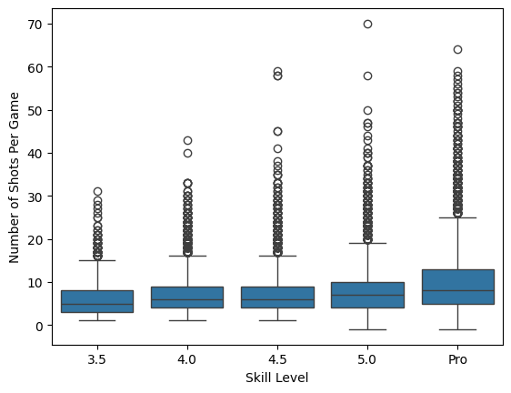
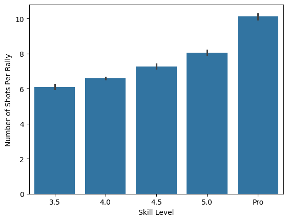
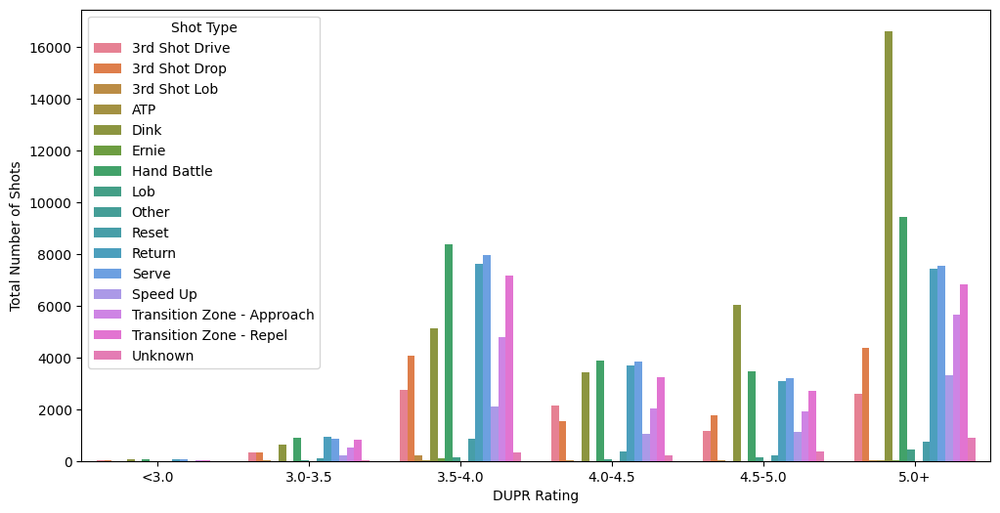
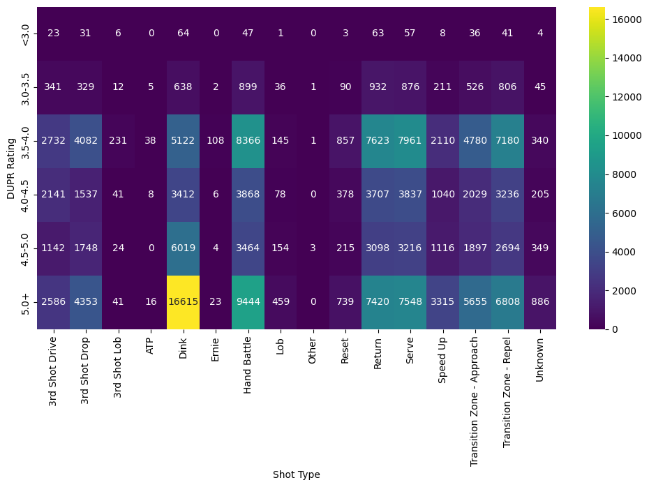

## Pickleball Performance Analysis 

This datasets consists of seven tables:
- game.csv 
- rally.csv
- shot.csv
- player.csv
- team.csv
- shot_type_ref.csv
- ball_type_ref.csv 

The objective for this project is to explore the following questions:
1. *What does the rally length distribution across skill levels look like?*
2. *How do shot types vary by DUPR rating?*

Additionally, the data will be used to create a model with the intent of predicting the type of shot a player is likely to make based on metrics like DUPR rating, shot types, and rally duration. 


Tools used:
- pandas
- matplotlib
- seaborn


### Loading Dataset and Data Cleaning


```python
# import relevant libraries
import pandas as pd
import numpy as np
import matplotlib.pyplot as plt
import seaborn as sns
 
# load the files in
ball_type_ref = pd.read_csv("ball_type_ref.csv")
game = pd.read_csv("game.csv")
player = pd.read_csv("player.csv")
rally = pd.read_csv("rally.csv")
shot = pd.read_csv("shot.csv")
shot_type_ref = pd.read_csv("shot_type_ref.csv")
team = pd.read_csv("team.csv")
```


```python
# how many columns + rows each dataset has
ball_type_ref.shape
```


    (16, 2)


```python
game.shape
```


    (935, 11)


```python
player.shape
```


    (923, 5)


```python
rally.shape
```


    (40702, 24)


```python
shot.shape
```


    (304649, 9)


```python
shot_type_ref.shape
```


    (17, 3)


```python
team.shape
```


    (1590, 3)


```python
# check for null values for non-ref tables
game.isnull().sum()
```


    game_id         0
    match_id        0
    game_nbr        0
    score_w         0
    score_l         0
    w_team_id       0
    l_team_id       0
    skill_lvl       0
    scoring_type    0
    ball_type       1
    dt_played       0
    dtype: int64


```python
player.isnull().sum()
```


    player_id                    0
    gender                       2
    dom_hand                     2
    doubles_dupr               554
    doublesreliabilityscore    551
    dtype: int64


```python
rally.isnull().sum()
```


    rally_id                      0
    game_id                       0
    match_id                      0
    rally_nbr                     0
    w_team_id                   379
    srv_team_id                   0
    srv_player_id               379
    rtrn_team_id                  0
    rtrn_player_id              379
    ts_player_id               8280
    ts_type                    3282
    to_ind                        0
    to_team_id                40323
    rally_len                   509
    ending_type                 383
    ending_player_id           3624
    srv_switch_ind                0
    rtrn_switch_ind               0
    srv_team_flipped_ind        379
    rtrn_team_flipped_ind       379
    srv_team_rs_player_id         0
    srv_team_ls_player_id         0
    rtrn_team_rs_player_id        0
    rtrn_team_ls_player_id        0
    dtype: int64


```python
shot.isnull().sum()
```


    shot_id           0
    rally_id          0
    shot_nbr          0
    shot_type        12
    player_id        76
    loc_x             0
    loc_y            84
    next_loc_x    12247
    next_loc_y    12247
    dtype: int64


```python
team.isnull().sum()
```


    team_id           0
    player_id         0
    player_seq_nbr    0
    dtype: int64


```python
# create a copy of the Player dataset with only rows that have a value for DUPR
# DUPR rating is needed for ou r analysis 
player_cleaned = player.dropna(subset=['doubles_dupr']).copy()
```


```python
# create a copy of the Rally dataset with only the rows that have a value for the rally length
# rally length is needed for analysis
rally_cleaned = rally.dropna(subset=['rally_len']).copy()
```


```python
# create a copy of the Shot dataset with only the rows that have a value for the shot type and player id 
shot_cleaned = shot.dropna(subset=['shot_type', 'player_id']).copy()
```

### Analyze rally length by skill levels


```python
# analyze rally length (number of shots per game) by skill level 
# focus on merging rally and game datasets 

# extract game_id and skill_lvl and left join on game_id
rally_skill_df = rally_cleaned.merge(game[['game_id', 'skill_lvl']], on='game_id', how='left')
rally_skill_df.head()
```


<table border="1" class="dataframe">
  <thead>
    <tr style="text-align: right;">
      <th></th>
      <th>rally_id</th>
      <th>game_id</th>
      <th>match_id</th>
      <th>rally_nbr</th>
      <th>w_team_id</th>
      <th>srv_team_id</th>
      <th>srv_player_id</th>
      <th>rtrn_team_id</th>
      <th>rtrn_player_id</th>
      <th>ts_player_id</th>
      <th>...</th>
      <th>ending_player_id</th>
      <th>srv_switch_ind</th>
      <th>rtrn_switch_ind</th>
      <th>srv_team_flipped_ind</th>
      <th>rtrn_team_flipped_ind</th>
      <th>srv_team_rs_player_id</th>
      <th>srv_team_ls_player_id</th>
      <th>rtrn_team_rs_player_id</th>
      <th>rtrn_team_ls_player_id</th>
      <th>skill_lvl</th>
    </tr>
  </thead>
  <tbody>
    <tr>
      <th>0</th>
      <td>R8968</td>
      <td>G208</td>
      <td>M113</td>
      <td>6</td>
      <td>T152</td>
      <td>T152</td>
      <td>P202</td>
      <td>T155</td>
      <td>P70</td>
      <td>P202</td>
      <td>...</td>
      <td>NaN</td>
      <td>Y</td>
      <td>N</td>
      <td>N</td>
      <td>N</td>
      <td>P203</td>
      <td>P202</td>
      <td>P70</td>
      <td>P205</td>
      <td>5.0</td>
    </tr>
    <tr>
      <th>1</th>
      <td>R8963</td>
      <td>G208</td>
      <td>M113</td>
      <td>1</td>
      <td>T155</td>
      <td>T152</td>
      <td>P202</td>
      <td>T155</td>
      <td>P70</td>
      <td>NaN</td>
      <td>...</td>
      <td>P203</td>
      <td>Y</td>
      <td>N</td>
      <td>N</td>
      <td>N</td>
      <td>P203</td>
      <td>P202</td>
      <td>P70</td>
      <td>P205</td>
      <td>5.0</td>
    </tr>
    <tr>
      <th>2</th>
      <td>R8964</td>
      <td>G208</td>
      <td>M113</td>
      <td>2</td>
      <td>T152</td>
      <td>T155</td>
      <td>P70</td>
      <td>T152</td>
      <td>P202</td>
      <td>P205</td>
      <td>...</td>
      <td>P205</td>
      <td>N</td>
      <td>Y</td>
      <td>N</td>
      <td>N</td>
      <td>P70</td>
      <td>P205</td>
      <td>P203</td>
      <td>P202</td>
      <td>5.0</td>
    </tr>
    <tr>
      <th>3</th>
      <td>R8965</td>
      <td>G208</td>
      <td>M113</td>
      <td>3</td>
      <td>T155</td>
      <td>T155</td>
      <td>P205</td>
      <td>T152</td>
      <td>P203</td>
      <td>P205</td>
      <td>...</td>
      <td>P203</td>
      <td>N</td>
      <td>Y</td>
      <td>N</td>
      <td>N</td>
      <td>P70</td>
      <td>P205</td>
      <td>P203</td>
      <td>P202</td>
      <td>5.0</td>
    </tr>
    <tr>
      <th>4</th>
      <td>R8966</td>
      <td>G208</td>
      <td>M113</td>
      <td>4</td>
      <td>T155</td>
      <td>T155</td>
      <td>P205</td>
      <td>T152</td>
      <td>P202</td>
      <td>P70</td>
      <td>...</td>
      <td>P205</td>
      <td>Y</td>
      <td>Y</td>
      <td>Y</td>
      <td>N</td>
      <td>P70</td>
      <td>P205</td>
      <td>P203</td>
      <td>P202</td>
      <td>5.0</td>
    </tr>
  </tbody>
</table>
<p>5 rows × 25 columns</p>
</div>


```python
# ensure skill levels are in the following order (from least to greatest): 3.5 -> 4.0 -> 4.5 -> 5.0 -> Pro
# BY DEFAULT "Pro" is not recognized as the highest value thus will mess up order 
from pandas.api.types import CategoricalDtype # this package will allow it to define a category order

skill_order = CategoricalDtype(['3.5', '4.0', '4.5', '5.0', 'Pro'], ordered=True) # define the order 
rally_skill_df['skill_lvl'] = rally_skill_df['skill_lvl'].astype(str).astype(skill_order) # first convert all values to string then cast the column into the ordered category
```


```python
# show with a box plot 
sns.boxplot(data=rally_skill_df, x='skill_lvl', y='rally_len')
plt.xlabel('Skill Level')
plt.ylabel('Average Number of Shots Per Rally')
```


    Text(0, 0.5, 'Number of Shots Per Game')


    

    


```python
# show with a bar plot 
sns.barplot(data=rally_skill_df, x='skill_lvl', y='rally_len')
plt.xlabel('Skill Level')
plt.ylabel('Average Number of Shots Per Rally')
```


    Text(0, 0.5, 'Number of Shots Per Rally')


    

    


### Shot types based on skill levels


```python
# analyze shot types based on skill levels
shot_type_skill_df = (
  shot_cleaned
  .merge(player_cleaned[['player_id', 'doubles_dupr']], on='player_id', how='inner') # use inner join to keep only values that have the player's DUPR rating and appear in shot_cleaned data
  .merge(shot_type_ref[['shot_type', 'shot_type_desc']], on='shot_type', how='left') # left join the shot type descriptions 
)

shot_type_skill_df.head()
```


<table border="1" class="dataframe">
  <thead>
    <tr style="text-align: right;">
      <th></th>
      <th>shot_id</th>
      <th>rally_id</th>
      <th>shot_nbr</th>
      <th>shot_type</th>
      <th>player_id</th>
      <th>loc_x</th>
      <th>loc_y</th>
      <th>next_loc_x</th>
      <th>next_loc_y</th>
      <th>doubles_dupr</th>
      <th>shot_type_desc</th>
    </tr>
  </thead>
  <tbody>
    <tr>
      <th>0</th>
      <td>S213113</td>
      <td>R26079</td>
      <td>2</td>
      <td>R</td>
      <td>P582</td>
      <td>18.35</td>
      <td>23.70</td>
      <td>18.64</td>
      <td>21.59</td>
      <td>5.023</td>
      <td>Return</td>
    </tr>
    <tr>
      <th>1</th>
      <td>S213112</td>
      <td>R26079</td>
      <td>1</td>
      <td>SE</td>
      <td>P197</td>
      <td>13.40</td>
      <td>22.32</td>
      <td>18.35</td>
      <td>23.70</td>
      <td>3.906</td>
      <td>Serve</td>
    </tr>
    <tr>
      <th>2</th>
      <td>S213152</td>
      <td>R26086</td>
      <td>1</td>
      <td>SE</td>
      <td>P488</td>
      <td>5.60</td>
      <td>22.97</td>
      <td>3.29</td>
      <td>24.25</td>
      <td>4.157</td>
      <td>Serve</td>
    </tr>
    <tr>
      <th>3</th>
      <td>S213210</td>
      <td>R26092</td>
      <td>2</td>
      <td>R</td>
      <td>P488</td>
      <td>5.50</td>
      <td>20.58</td>
      <td>9.81</td>
      <td>12.03</td>
      <td>4.157</td>
      <td>Return</td>
    </tr>
    <tr>
      <th>4</th>
      <td>S213209</td>
      <td>R26092</td>
      <td>1</td>
      <td>SE</td>
      <td>P194</td>
      <td>3.38</td>
      <td>22.78</td>
      <td>5.50</td>
      <td>20.58</td>
      <td>3.898</td>
      <td>Serve</td>
    </tr>
  </tbody>
</table>
</div>


```python
# create grouped bar plot for visualization
# will first need to bin the DUPR ratings
dupr_bins = [0, 3.0, 3.5, 4.0, 4.5, 5.0, 6.0]
dupr_labels = ['<3.0', '3.0-3.5', '3.5-4.0', '4.0-4.5', '4.5-5.0', '5.0+']

# slice up the DUPR values and place them into bins and into a new column, dupr_bin
shot_type_skill_df['dupr_bin'] = pd.cut(shot_type_skill_df['doubles_dupr'], bins=dupr_bins, labels=dupr_labels, right=False)
shot_type_skill_df.head()

```


<table border="1" class="dataframe">
  <thead>
    <tr style="text-align: right;">
      <th></th>
      <th>shot_id</th>
      <th>rally_id</th>
      <th>shot_nbr</th>
      <th>shot_type</th>
      <th>player_id</th>
      <th>loc_x</th>
      <th>loc_y</th>
      <th>next_loc_x</th>
      <th>next_loc_y</th>
      <th>doubles_dupr</th>
      <th>shot_type_desc</th>
      <th>dupr_bin</th>
    </tr>
  </thead>
  <tbody>
    <tr>
      <th>0</th>
      <td>S213113</td>
      <td>R26079</td>
      <td>2</td>
      <td>R</td>
      <td>P582</td>
      <td>18.35</td>
      <td>23.70</td>
      <td>18.64</td>
      <td>21.59</td>
      <td>5.023</td>
      <td>Return</td>
      <td>5.0+</td>
    </tr>
    <tr>
      <th>1</th>
      <td>S213112</td>
      <td>R26079</td>
      <td>1</td>
      <td>SE</td>
      <td>P197</td>
      <td>13.40</td>
      <td>22.32</td>
      <td>18.35</td>
      <td>23.70</td>
      <td>3.906</td>
      <td>Serve</td>
      <td>3.5-4.0</td>
    </tr>
    <tr>
      <th>2</th>
      <td>S213152</td>
      <td>R26086</td>
      <td>1</td>
      <td>SE</td>
      <td>P488</td>
      <td>5.60</td>
      <td>22.97</td>
      <td>3.29</td>
      <td>24.25</td>
      <td>4.157</td>
      <td>Serve</td>
      <td>4.0-4.5</td>
    </tr>
    <tr>
      <th>3</th>
      <td>S213210</td>
      <td>R26092</td>
      <td>2</td>
      <td>R</td>
      <td>P488</td>
      <td>5.50</td>
      <td>20.58</td>
      <td>9.81</td>
      <td>12.03</td>
      <td>4.157</td>
      <td>Return</td>
      <td>4.0-4.5</td>
    </tr>
    <tr>
      <th>4</th>
      <td>S213209</td>
      <td>R26092</td>
      <td>1</td>
      <td>SE</td>
      <td>P194</td>
      <td>3.38</td>
      <td>22.78</td>
      <td>5.50</td>
      <td>20.58</td>
      <td>3.898</td>
      <td>Serve</td>
      <td>3.5-4.0</td>
    </tr>
  </tbody>
</table>
</div>


```python
# create a new DataFrame that selects only the DUPR bins, shot types, and count of each shot type

# group the data by DUPR bin and shot type, count the number of rows within each grouping, and names the count column
grouped_shots_df = shot_type_skill_df.groupby(['dupr_bin', 'shot_type_desc']).size().reset_index(name='count')
grouped_shots_df.head()
```

    C:\Users\Public\Documents\Wondershare\CreatorTemp\ipykernel_4128\1121139930.py:4: FutureWarning: The default of observed=False is deprecated and will be changed to True in a future version of pandas. Pass observed=False to retain current behavior or observed=True to adopt the future default and silence this warning.
      grouped_shots_df = shot_type_skill_df.groupby(['dupr_bin', 'shot_type_desc']).size().reset_index(name='count')
    


<table border="1" class="dataframe">
  <thead>
    <tr style="text-align: right;">
      <th></th>
      <th>dupr_bin</th>
      <th>shot_type_desc</th>
      <th>count</th>
    </tr>
  </thead>
  <tbody>
    <tr>
      <th>0</th>
      <td>&lt;3.0</td>
      <td>3rd Shot Drive</td>
      <td>23</td>
    </tr>
    <tr>
      <th>1</th>
      <td>&lt;3.0</td>
      <td>3rd Shot Drop</td>
      <td>31</td>
    </tr>
    <tr>
      <th>2</th>
      <td>&lt;3.0</td>
      <td>3rd Shot Lob</td>
      <td>6</td>
    </tr>
    <tr>
      <th>3</th>
      <td>&lt;3.0</td>
      <td>ATP</td>
      <td>0</td>
    </tr>
    <tr>
      <th>4</th>
      <td>&lt;3.0</td>
      <td>Dink</td>
      <td>64</td>
    </tr>
  </tbody>
</table>
</div>


```python
# bar plot for the new DataFrame, grouped_shots_df
plt.figure(figsize=(12,6))
sns.barplot(data=grouped_shots_df, x='dupr_bin', y='count', hue='shot_type_desc')
plt.xlabel('DUPR Rating')
plt.ylabel('Total Number of Shots')
plt.legend(title='Shot Type')
```


    <matplotlib.legend.Legend at 0x172f5afbf10>


    

    


```python
# pivot the DataFrame 
heatmap_shots = grouped_shots_df.pivot(index='dupr_bin', columns='shot_type_desc', values='count')

# plot the heatmap
plt.figure(figsize=(12,6))
sns.heatmap(heatmap_shots, annot=True, fmt='g', cmap='viridis')
plt.xlabel('Shot Type')
plt.ylabel('DUPR Rating')

```


    Text(120.72222222222221, 0.5, 'DUPR Rating')


    

    


```python

```
